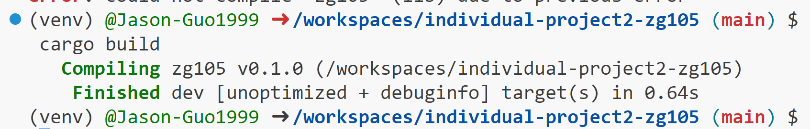
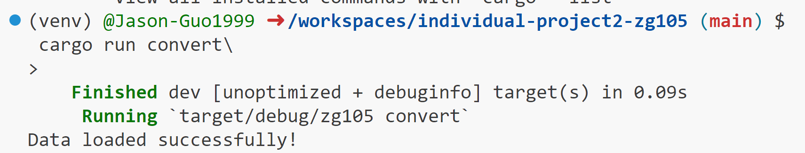
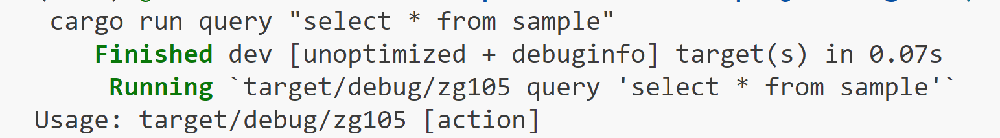
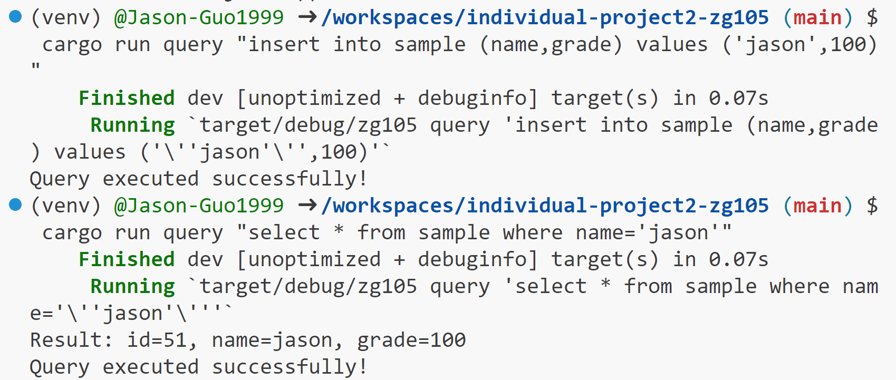
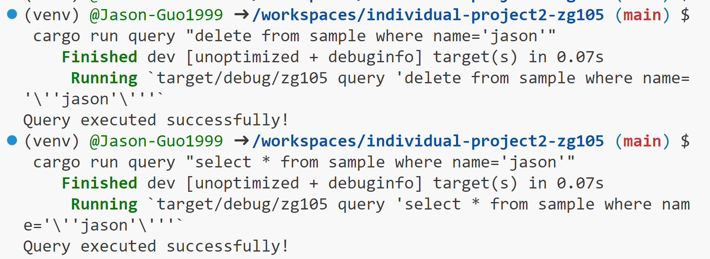
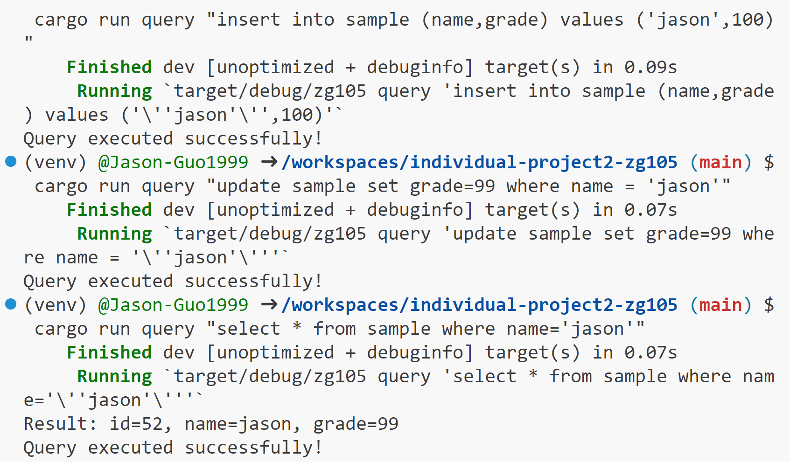

# Individual project 2 zg105

In this individual project we read from a csv file and convert it into a sqlite database, then we will do some CRUD operations on the database.

## Prerequisites

- reqwest = { version = "^0.11", features = ["blocking"] }
- rusqlite = "^0.29"
- csv = "^1.0"
- assert_cmd = "^2.0"
- predicates = "0.9"

## Functions

1. **src/lib.rs**: the rust script to read data.csv, convert it into a database and query functions.

2. **src/main.rs**: the rust script to read command and do corresponding operations.

3. **Cargo.toml**: Run with "cargo build" to start a new project with dependencies.

## Demo
run "cargo build" to start

run "cargo convert" to read the data.csv and convert it into zg105.db

run "cargo run query [lines]" to do query

# read

# insert

# delete

# update

